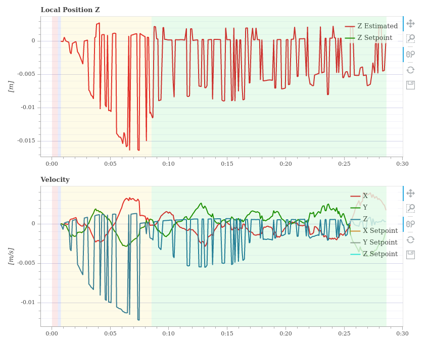
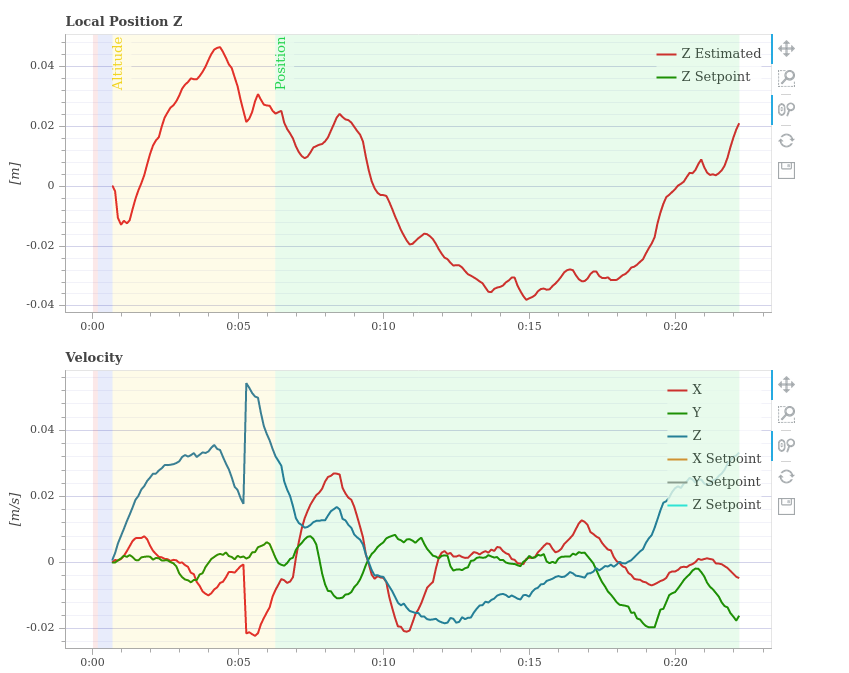
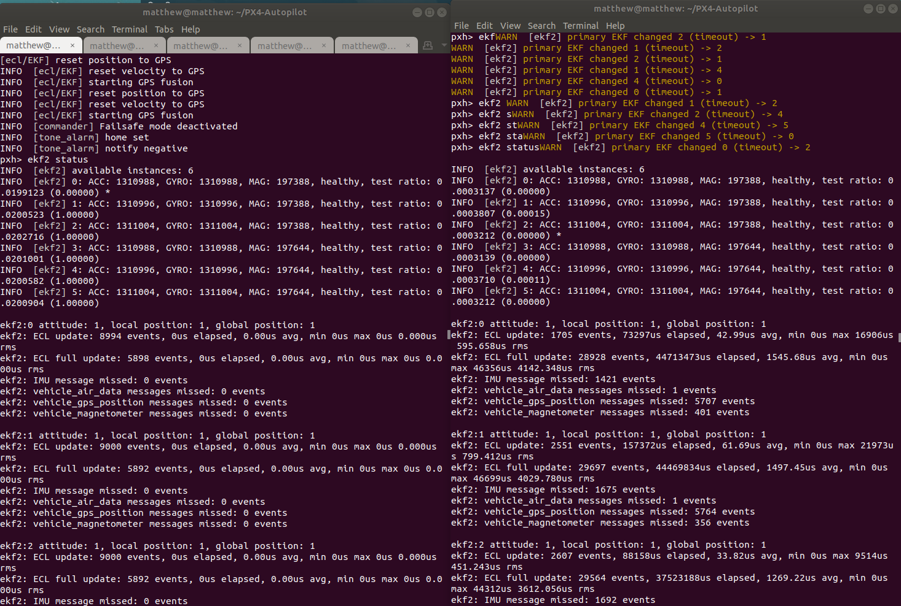

# PX4-UNITY-Simulator
Unity3d Environment for UAV simulation, with connection to **PX4-SITL**

## Setup
1. Git clone
```bash
# Git clone this repo into your Unity Asset folder
cd <Asset-Directory>
git clone https://github.com/matthewoots/px4-unity-simulator.git --recurse-submodules
```

2. Inside Unity-Editor
```bash
# You will find errors when you first load the package inside 
# Don't worry
# 1. Go into <build settings>
# 2. Go into <player settings>
# 3. Under <player> tab, find "Api Compatibility Level*" and choose .NET 4.x
# 4. Under <player> tab, find "Allow 'unsafe' Code" and enable it
# You will be able to compile it with minimal/not important errors
```

3. Run the SampleScene.unity scene

4. Go to your `PX4-Autopilot` repository and run `make px4_sitl none`

## Progress
- Able to connect PX4 to Unity via TCP
- EKF2 is not fusing, and some suspicions and data are shown below

| |  | 
|---|---|

| | 
|---|

## Platform
**[HARDWARE]**
- Ubuntu 18.04
- Intel® Xeon(R) CPU E3-1535M v6 @ 3.10GHz × 8 
- NVIDIA Quadro M2200

**[SOFTWARE]**
- Unity 2020.3.6f1

**[NOT SUPPORTED ON UNITY-UBUNTU]**
- [HDRP] is not supported
- [Substance engine] is not supported

Created by Matthew Woo 2022